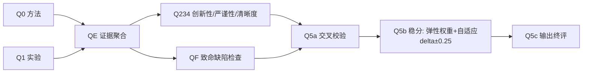
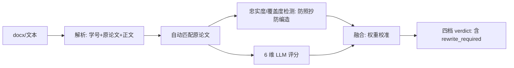

# PaperForge：基于本地论文库的学术写作助手 —— 功能介绍报告

> 提交对象：指导教师 ｜ 文档性质：项目功能汇报 ｜ 版本：基于 PaperForge 实测数据整理

---

## 摘要

PaperForge 是一款**本地化**的学术写作桌面工具，覆盖"文献检索 → 阅读 → 写作 → 评审 → 导出"的完整链路。它和普通 AI 写作工具最根本的区别在于：**所有引用只能来自用户自己本地库中的论文**，库里没有的文献系统一律不编造，导出时还会自动附上 AI 使用声明。核心理念是 **零幻觉 · 隐私优先 · 开箱即用**。本报告面向课程/项目汇报，系统介绍其核心功能模块、技术架构与经过验证的关键指标；并补充介绍**感悟/反思报告智能评审**这一面向教学场景的能力——它是除论文之外、系统支持评审的另一类对象。

---

## 一、项目背景与动机

学术写作长期面临三个痛点：

1. **引用编造（幻觉）**：通用 AI 写作工具常"生成"看似合理的参考文献，实则并不存在，严重影响学术诚信。
2. **隐私顾虑**：把未发表的草稿、内部资料上传到第三方云端，存在泄露风险。
3. **工具割裂**：检索、阅读、写作、排版分散在不同软件，上下文无法贯通。

PaperForge 的定位正是用一套本地优先的工具链同时化解这三个问题：论文留在本地、引用可溯源、写作与评审在同一界面完成。

---

## 二、核心承诺：三大差异化

| 承诺 | 具体体现 |
| :--- | :--- |
| **零幻觉** | 引用只能来自本地库；问到库中没有的文献时，系统明确回答"库中没有"，而非编造参考文献 |
| **隐私优先** | 支持完全离线运行；论文与写作数据不离开本机；可仅接本地 llama.cpp 推理 |
| **开箱即用** | 提供桌面 `.exe` 与一键启动脚本；模型可在界面内可视化配置，无需命令行 |

---

## 三、功能详解（核心模块）

### 3.1 建库：把论文收进来

| 能力 | 说明 |
| :--- | :--- |
| arXiv 搜索导入 | 按关键词/ID 批量拉取，自动补全标题、作者、摘要、年份 |
| PDF 拖拽上传 | 自动解析元数据并分块建索引，支持批量 |
| Zotero 导入 | 直接同步已有文献库 |
| 元数据补全 | 可接 Semantic Scholar 补全缺失字段 |
| 查重与去重 | 标题/DOI 相似度识别重复条目 |

### 3.2 检索与阅读：三种方式找得到

- **混合检索**：SQLite FTS5 关键词 + 向量语义 + RRF 融合排序，关键词命中和语义相关都不漏。
- **PDF 标注**：内置阅读器高亮、批注，标注可回链到笔记。
- **论文笔记**：为每篇论文记笔记，写作时可检索引用。

### 3.3 问答：答案只来自你的库（RAG）

基于检索增强生成（RAG）的问答，回答**必须给出处**。当问题涉及库中不存在的文献，系统会如实告知而非编造，从机制上杜绝"凭空引用"。

### 3.4 深度评审 DEPTH v4.2（最有分量的功能）

DEPTH 不是让模型"打个分"，而是把评审拆成一条多节点流水线，各节点并行/串行协同：

- **Q0/Q1 并行**：方法与实验两条线各自独立评估，互不干扰。
- **QE 证据聚合**：把分散在各节点的证据收拢成统一论据。
- **Q234/QF 并行**：创新性、严谨性、清晰度与"致命缺陷"检查同时跑。
- **Q5a/b/c 收敛**：交叉校验 → 稳分（弹性权重 + 自适应 delta ±0.25）→ 输出终评。

输出是**分项分数 + 每一分对应的依据**，而非一句"这篇不错"。详见本文第五节"评分严谨化"。

### 3.5 写作工作台

- 项目管理 → 大纲编辑 → 逐章写作的完整流程。
- AI 续写 / 改写 / 结构建议。
- **引用推荐与插入**：根据当前段落语义从库中推荐可引文献，一键插入。
- 章节版本快照，可回溯。

### 3.6 导出

| 格式 | 说明 |
| :--- | :--- |
| Markdown | 纯文本，含引用列表 |
| Word (.docx) | python-docx 生成，保留格式 |
| LaTeX | `.tex` + `.bib` 引用文件 |
| PDF | 浏览器原生 `window.print()`，无额外依赖 |

导出时自动：生成参考文献列表、**注入「AI 使用声明」章节**、校验引用是否真实存在于库中。

### 3.7 学术关系分析

- **被引情感分析**：读引用上下文，判断其他文献对目标论文是支持 / 批评 / 背景引用。
- **关系图可视化**：中心论文 + 情感边 + 语义相似度 fallback，看清一篇论文在领域中的位置。

### 3.8 模型与部署

- 接入任何 **OpenAI 兼容 API**（本地 llama.cpp / Ollama、智谱、DeepSeek 等），运行时可切换。
- 推荐本地模型 **Ornith-1.5-9B**（Q4_K_M，llama.cpp 推理服务）。
- 可**完全离线**运行。
- 中 / 英文界面切换。

### 3.9 感悟报告智能评审（教学场景）

> 除了评论文，PaperForge 还能评**学生写的感悟 / 读后 / 复现报告**——这是它区别于普通写作工具的"教学辅助"能力：帮老师和学生判断一份读后感到底写得怎样。

学生提交对某篇论文的感悟报告（支持 `.docx` 上传或纯文本），系统自动完成一条评审流水线：

1. **解析与绑定**：从 docx 抽取学号 / 姓名、原论文题目与正文，自动匹配库中对应的原论文。
2. **上下文构建**：为评审模型补充"论文全文摘要 + 关键句"，让它判断时有据可依（而非只看论文前几段）。
3. **忠实度与覆盖度检测（防照抄 / 防编造）**：用向量比对计算报告与原论文的相似度、覆盖度；照抄原文或明显编造观点会被直接判为 `rewrite_required`（需重写）。
4. **六维评分融合**：理解准确性、分析深度、创新见解、证据支撑、忠实度、覆盖度，按校准权重融合为总分与分项依据。
5. **四档结论**：`well_done` / `needs_evidence`（证据不足）/ `needs_depth`（理解或创新不足）/ `rewrite_required`（照抄或编造）。

**与 DEPTH 论文评审的关键区别**：感悟报告评审是"单次 LLM + 硬门"的轻量设计（教学场景下多评审员 × 每篇成本不可接受），重点不在"这篇论文好不好"，而在**学生有没有读懂、有没有照抄、有没有自己的见解**；并且遵循"**仅评不改**"原则——AI 只给出分数与依据，绝不改写学生原文，保持学术诚信透明。

**同样经过严谨化校准（ADR-014）**：可复现种子、引用 Crossref 验真、bootstrap 置信区间、金标回归测试全部套用到该流水线；六维权重由 41 篇人工基准的控制变量实验校准，排序一致性（Spearman ρ）从 0.422 提升到 0.476。

---

## 四、技术架构

| 层级 | 技术栈 |
| :--- | :--- |
| 前端 | React 19 + TypeScript + Ant Design 6 + Zustand + Vite |
| 后端 | FastAPI + SQLAlchemy + SQLite |
| AI 网关 | OpenAI 兼容协议，多 Provider 运行时切换 |
| 本地推理 | llama.cpp（Ornith-1.5-9B Q4_K_M） |
| 向量引擎 | Fastembed (ONNX Runtime) + BAAI/bge-small-en-v1.5（384 维） |
| 视觉理解 | 云端 GLM-4V-Flash（图表提取 / 图文一致性） |

设计上后端 `main.py` 仅约 73 行作为路由装配入口，业务按 19 个路由模块拆分，数据库 32 张表，便于维护与扩展。

---

## 五、关键亮点：评分严谨化与可信度（ADR-014）

DEPTH 的评分不是"调好就完"，而是通过一套严谨化方法论（架构决策记录 ADR-014）持续校准：

- 采用 **415 篇抽样盲评金标集**进行校准。
- 经偏移修正后，评审员间一致性 **Cohen's κ 从 0.189 提升到 0.375**，显著降低了主观波动。
- 评审过程透明：种子固定、快照可复现、引用防伪造校验，导出自动声明 AI 使用范围。
- **感悟报告评审**同样套用该方法论（ADR-014 P0–P4），并独有防照抄 / 防编造的忠实度、覆盖度硬校验——详见 3.9 节。

这意味着两套评审给出的分数不仅"有依据"，而且在不同运行、不同模型来源下都尽量稳定可比——这是把它和传统"AI 给个分"区分开的关键。

---

## 六、项目规模与验证数据（实测）

| 指标 | 数值 |
| :--- | :--- |
| 论文入库 | 950 篇（其中 386 篇已建向量索引） |
| DEPTH v4 评审记录 | 854 条 |
| 感悟报告人工基准 | 41 篇（六维权重校准用） |
| 数据库表 | 32 张 |
| 后端路由模块 | 19 个（`main.py` 仅 73 行装配入口） |
| 前端页面 / 组件 | 19 个页面 / 104 个组件 |
| 自动化测试 | 1720 个（pytest 收集数） |

测试覆盖与 CI（ruff 硬门禁 + pytest 覆盖率）保障了功能的可维护性。

---

## 七、使用与部署

- **桌面版**：下载 `.exe` 双击运行，浏览器自动打开，界面内配置模型即用。
- **一键启动（Windows）**：双击 `start_paperforge.bat`，自动探测端口、启动后端、按需构建前端。
- **开发者模式**：`pip install` 后端依赖 + `npm install && npm run dev` 前端，或仅启后端访问 `127.0.0.1:8770` 加载已构建前端。
- **Docker**：`docker compose up -d` 启动带本地推理服务的环境。
- **打包**：PyInstaller 单文件 `.exe`，或 Docker 可重现构建。

---

## 八、总结

PaperForge 把"本地论文库 + 可信 AI 写作 + 严谨评审"整合到一个离线优先的工具中，用**引用可溯源**和**评分可校准**两条硬约束，直接回应学术写作中最棘手的幻觉与诚信问题。除论文 DEPTH 评审外，它还把同一套严谨化能力延伸到**感悟 / 反思报告的智能评审**（防照抄、防编造、仅评不改），覆盖了从建库、写作到两类对象评审、导出的完整链路；1700+ 测试与金标校准为其实用性与可信度提供了实证支撑，适合作为个人与教学场景中学术写作及研究管理的长期基础设施。

---

*数据来源：PaperForge 项目 README、架构文档（ADR-014）、评分量规（`reflection_rubric.yaml`、`depth_rubric.yaml`）与本地库实测统计。本报告仅介绍已落地功能，不含未发布规划。*
